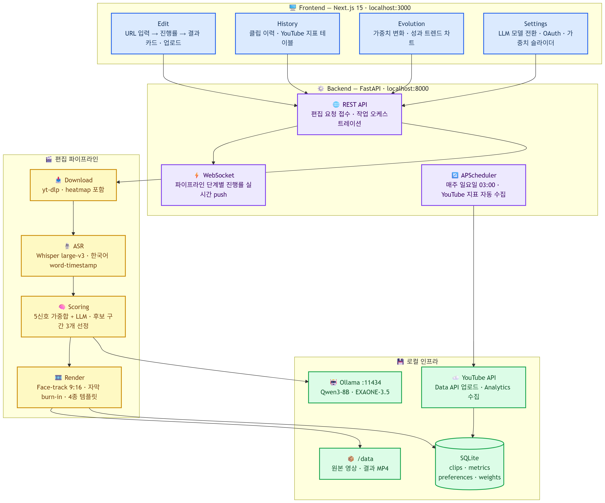
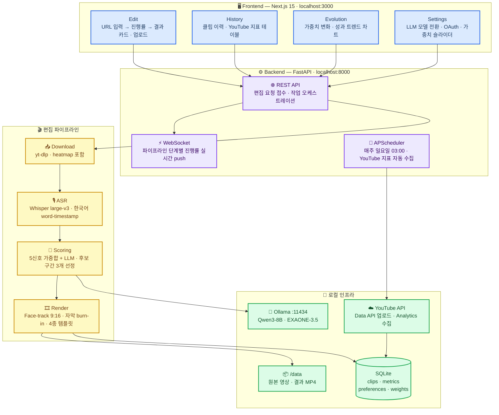

# K-Shorts — 한국 예능 자동 숏폼 편집기

한국 예능 롱폼 영상(YouTube URL)을 입력하면 AI가 재미있는 구간을 찾아 **9:16 세로 숏츠**로 자동 편집하는 로컬 웹 앱.

> 캡스톤 디자인 프로젝트 | 2101070 이준인

---

## 데모 클립

> `demo/` 폴더에 실제 생성된 숏츠 샘플 2개 포함

| 파일 | 설명 |
|------|------|
| `demo/clip_695bb1def303_0.mp4` | 샘플 클립 #1 |
| `demo/clip_48f07ce93ef9_1.mp4` | 샘플 클립 #2 |

---

## 시스템 아키텍처





---

## 기술 스택

| 계층 | 기술 |
|------|------|
| Frontend | Next.js 15 · Tailwind · shadcn/ui |
| Backend | FastAPI · Python 3.11 · SQLite |
| ASR | faster-whisper large-v3 |
| LLM | Ollama (Qwen3-8B · EXAONE-3.5) |
| 영상 처리 | ffmpeg · MediaPipe Face-track |
| 오디오 분석 | librosa · panns_inference · Wav2Vec2-Emotion |
| 인프라 | Docker Compose · NVIDIA RTX 3070 |

---

## 실행 방법

```bash
# .env 파일 생성 (최초 1회)
cp .env.example .env   # 없으면 아래 내용으로 직접 생성

docker compose up --build
```

**.env 최소 내용:**
```
DEFAULT_LLM_MODEL=qwen3:8b
OLLAMA_HOST=http://ollama:11434
DATA_DIR=/data
DATABASE_URL=sqlite:////data/k-shorts.db
```

서비스 주소:

| 서비스 | 주소 |
|--------|------|
| 대시보드 | http://localhost:3000 |
| API | http://localhost:8000 |
| API 문서 | http://localhost:8000/docs |

---

## 구현 현황

### 완료

- [x] Docker Compose 3-서비스 구성 (ollama / api / web)
- [x] yt-dlp 영상 다운로드 + heatmap 추출
- [x] Whisper large-v3 한국어 ASR (word-timestamp)
- [x] 5신호 융합 스코어링 (retention · laughter · volume · emotion · tempo)
- [x] Ollama LLM 후보 구간 선정 (Qwen3-8B)
- [x] 구간 경계 스냅 (침묵·단어 경계 정렬, 15~59초 강제)
- [x] MediaPipe Face-track 9:16 리프레임 + EMA 스무딩
- [x] ASS 자막 burn-in (Whisper word-timestamp 기반)
- [x] 4종 렌더 템플릿 (Clean · Soft · Bold · Split)
- [x] WebSocket 실시간 진행률 push
- [x] SQLite 클립·신호·가중치 이력 저장
- [x] Phase 1 선호 피드백 (👍/👎 few-shot 주입)
- [x] Phase 2 가중치 자동 업데이트 알고리즘

### 미구현 (TODO)

#### YouTube 업로드 기능
- [ ] Google OAuth 2.0 플로우 (`/settings` → YouTube 연결 버튼)
- [ ] `client_secret.json` 발급 및 `backend/` 배치
- [ ] `google-api-python-client` 업로드 엔드포인트 연결
- [ ] 업로드 후 `clips.yt_video_id` DB 저장
- [ ] YouTube Analytics API 지표 수집 cron 활성화

#### 대시보드 UI 오류
- [ ] Edit 페이지: 편집 완료 후 결과 카드 3개 렌더링 미연결 (API 응답 → UI 바인딩 누락)
- [ ] History 페이지: 클립 목록 조회 API 연결 미완성
- [ ] Evolution 페이지: Recharts 가중치 변화 차트 데이터 바인딩 미완성
- [ ] Settings 페이지: 가중치 슬라이더 `PATCH /weights` 호출 미연결

---

## 설계 문서

[docs/superpowers/specs/2026-04-21-korean-shorts-autoeditor-design.md](docs/superpowers/specs/2026-04-21-korean-shorts-autoeditor-design.md)
